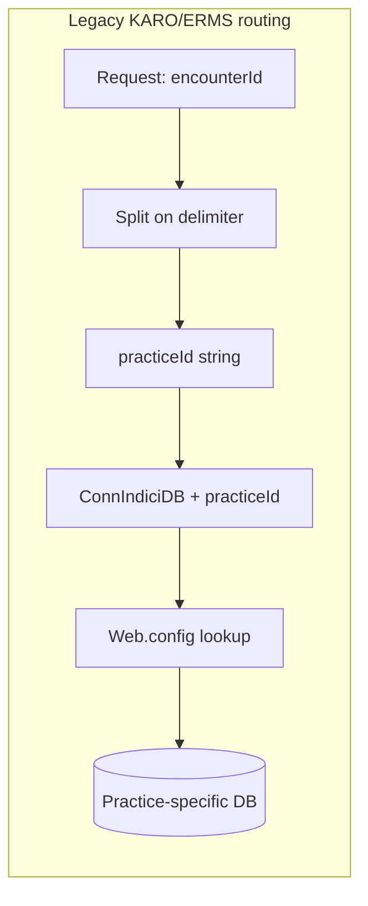
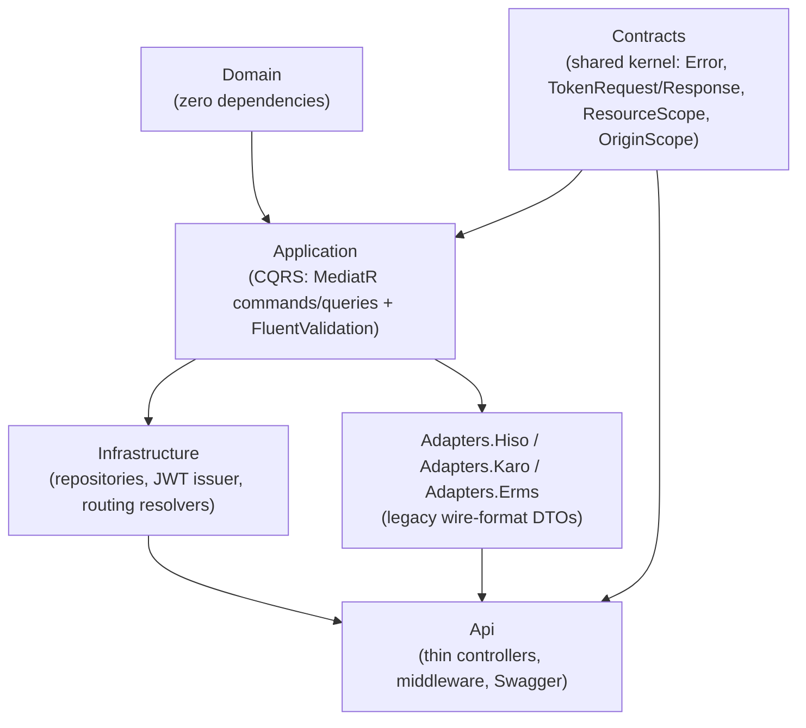
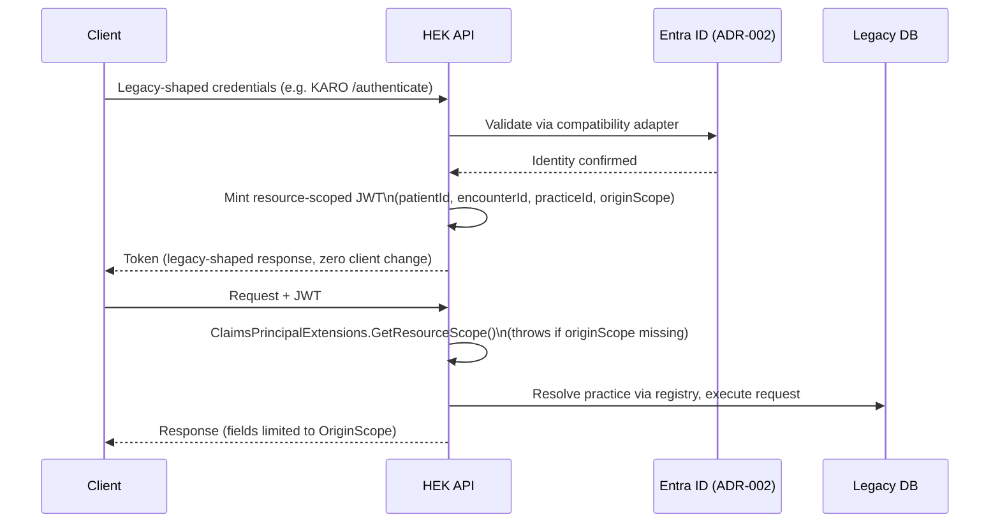

# HEK Unified Healthcare API — Management Presentation
### Legacy Systems Modernization: HISO, KARO, ERMS → Unified API Hub
**Prepared:** 2026-07-22 · **Audience:** Technical management / architects · **Duration:** 15–20 minutes

> **Sourcing note:** Every factual claim in this document is drawn from the project's own analysis reports (`hek_analysis/docs/analysis/{hiso,karo,erms}/*.md`), `ComparisonReport.md`, `MigrationRecommendations.md`, the Enterprise Architecture Document, ADR log, `PROJECT_STATUS.md` (authoritative status log), and direct inspection of source code. Where a fact could not be confirmed, it is explicitly marked **[UNCONFIRMED]**. Nothing in this document is invented or assumed.

---

## 1. Executive Summary

**Business problem:** The organisation runs three independently-built, independently-maintained integrations against the same underlying Indici Practice Management System (PMS) database — **HISO** (ACC45 accident-claim form exchange, NZ HISO 10014.2 standard), **KARO/HSSWebAPI** (Indici ↔ HSS portal bridge), and **ERMS/ERMSWebAPI** (eReferrals + an undocumented "COL/Pegasus" financial claiming integration). All three were found, through direct code inspection, to share a byte-identical `DAL` codebase — including identical hardcoded secrets and an identical live SQL injection in a dormant module.

**Why a unified API was required:**
- No real authentication in any of the three systems today.
- A confirmed, exploitable SQL injection shared verbatim across two of the three codebases.
- A hardcoded SQL Server credential and a hardcoded encryption key baked into source, shared across systems.
- New-practice onboarding requires a config change and redeployment (fixed connection-string lists), not a data change.
- .NET Framework 4.8 / WCF / OWIN — no path to modern hosting, containerization, or horizontal scaling.
- No tests, no rate limiting, no audit logging, PHI logged in plaintext.

**Objective:** One modern .NET 8 Clean Architecture API that (a) reproduces every legacy capability with **zero required change for existing consumers** (HSS Portal, ERMS eReferrals, COL/Pegasus, HealthLink form engines), and (b) fixes the confirmed security defects, while a canonical/unified layer is built alongside it for future consumers.

**Where we are today:** Phase 12 of 17 (Development), in progress. All 56 real legacy operations across the four integration surfaces have been ported from **actual legacy source code** (not guesses) and live-verified against real production-shaped data. The system is explicitly **not production-ready**: security enforcement ships off-by-default, Docker has never been run successfully end-to-end on the dev machine, and Testing / Performance Testing / Security Review / Deployment / Production Readiness are all formally not started.

---

## 2. Legacy System Overview

### HISO

| Aspect | Detail |
|---|---|
| Purpose | NZ HISO 10014.2 "Form Session" integration — exchanges ACC45 accident-claim form data with the PMS on behalf of HealthLink-style clinical form engines. |
| Architecture | Single-tier **WCF SOAP** service (`FormSessionService.svc`, 6 operations). Two competing, inconsistent DAL helpers plus widespread direct inline ADO.NET. A database-driven "concept mapping" engine resolves HL7/HISO concept names to stored procedures at runtime. No DI, no interfaces, no tests. |
| Deployment | IIS-hosted ASP.NET web application. **[UNCONFIRMED]** production server count/topology — no infra docs found. |
| Request format | SOAP/XML exclusively. |
| Response format | SOAP/XML. |
| Authentication | **None at the framework level** (`security mode="None"`). "Auth" is an opaque, non-expiring session GUID looked up in the DB with no expiry check, no single-use marking. Failed lookups are silently swallowed (`catch (Exception) {}`). |
| Routing | No per-practice routing concept — 4 fixed named DB connections; "second node" selection via a stored-procedure-name allow-list, not a tenant identifier. |
| Database | SQL Server, stored procedures, one shared plaintext credential across all 4 connections. |
| Session handling | Re-fetched from DB every call, no caching, no logout/invalidation endpoint. |
| Technologies | WCF, ASP.NET, .NET Framework, Aspose (server-side PDF/DOCX rendering). |

### KARO (HSSWebAPI)

| Aspect | Detail |
|---|---|
| Purpose | Bridges the Indici PMS to the HSS portal — demographics, clinical notes, conditions, medications, labs, recalls, documents, invoices, templated encounter-summary forms. |
| Architecture | ASP.NET Web API 2, one 2,047-line controller with 24 actions, calling a shared `DAL` class library via **precompiled binary references** to a folder outside the repo (confirms this repo is an extracted subset of a larger solution). 11 of 12 DAL subsystems are dead code from KARO's own controller but still compiled in. No DI, no service/repository layer, no tests. |
| Deployment | IIS-hosted, OWIN host, .NET Framework 4.8. |
| Routing | `encounterId` string split on delimiters (`_`/`__`) to extract a practice ID, concatenated directly onto a connection-string **name** (`"ConnIndiciDB" + practiceid`) — repeated inline in ~24 separate controller actions, no central registry. |
| Request/Response | JSON. |
| Authentication | No framework auth. Custom bearer token from `/api/Authenticate`, re-validated **per call** against a stored procedure. GET variant accepts credentials as URL query parameters; both variants log the raw plaintext password. |
| Database | SQL Server, 12 connection-string targets, 6 environment variants, plaintext credentials in `Web.config`. |
| Configuration | `Web.config` per-environment connection strings; a hardcoded PHO override for one specific practice suffix. |
| Technologies | ASP.NET Web API 2, OWIN, EF6 referenced but unused, `Newtonsoft.Json`. |

### ERMS (ERMSWebAPI)

| Aspect | Detail |
|---|---|
| Purpose | Two consumers behind one app: **ERMS** eReferrals (XML, HISO-concept-based, 23 actions) and an undocumented **COL/Pegasus** financial claiming integration (JSON, 7 actions, including the `SaveInvoice` write). |
| Architecture | Structurally near-identical to KARO's `DAL` (same subfolders/classes, same SQL injection at matching line numbers). Two controllers, ~25-line copy-pasted auth/routing boilerplate across all 30 actions. No DI, no tests. |
| Deployment | IIS-hosted, OWIN self-host, .NET Framework 4.8. |
| Routing | Same delimiter-split pattern as KARO, plus a **4th "PHO" segment** that silently triggers a proxy-forward to an Azure ERMS mirror for tagged practices. |
| Request/Response | XML (`APIController`) and JSON (`COLController`). |
| Authentication | Same design as KARO — same stored procedure, same per-call re-validation; unlike KARO, expiry is actually wired (12 hours). |
| Database | 15 connection strings in `Web.config` (7 practice-keyed pairs + default), **several pointing at a public IP address**. |
| Configuration | `Web.config`; onboarding a practice requires a config change and redeploy. |
| Technologies | ASP.NET Web API 2, OWIN, `Newtonsoft.Json` 13.0.1, unused `NLog` reference. |

---

## 3. Legacy Architecture Comparison

| Dimension | HISO | KARO | ERMS |
|---|---|---|---|
| Protocol | SOAP/XML | REST/JSON | REST — XML (`APIController`) + JSON (`COLController`) |
| Framework auth | None | None | None |
| Auth mechanism | Opaque session GUID, no expiry | Bearer token, re-validated per call | Same as KARO, expiry actually wired (12h) |
| Role/claims model | None | None | None |
| Practice routing | Fixed 4 connections, no tenant concept | Delimiter-split `encounterId` → connection-string name | Same + 4th PHO segment → Azure-mirror proxy |
| Connection strings | 4 fixed | 12 targets (2 reachable) | 15 (public-IP exposure) |
| Confirmed SQL injection | None in reachable code | Confirmed, dormant `DMSDA.cs`/`DBMessages.cs` | Same confirmed injection, same dormant files |
| CORS | N/A (SOAP) | Wildcard on entire controller | Commented out on `APIController`; wildcard on `COLController` (incl. financial write) |
| HTTP status semantics | SOAP Fault (distinguishable) | Always HTTP 200 | Always HTTP 200 |
| Debug/error exposure | `includeExceptionDetailInFaults=true` | `debug=true` left on | Same |
| Rate limiting | None | None | None |
| Logging | Proprietary flat-file `Logger.dll`, PHI/secrets in plaintext | Same, plaintext passwords logged | Same, plus live bearer tokens logged, silent logging failures (`catch{}`) |

**Shared cross-cutting facts:** identical hardcoded SQL symmetric-key password (`tcpepms*1`) confirmed in HISO and KARO; identical `AWSDoc.dll` document-storage dependency; a two-step non-atomic "DMS write + PMS index write" with no distributed transaction, in all three.

---

## 4. Legacy Routing Analysis

**HISO** — no per-practice routing exists. All context comes from a session-GUID database lookup; "database resolution" is a fixed 4-connection set plus a stored-procedure-name allow-list for a "second node."

**KARO / ERMS (identical pattern)** —
```
encounterId = "<encryptedEncounterId>__<practiceId>[_<subPracticeId>]"     (KARO)
encounterId = "<encryptedEncounterId>__<practiceId>_<subPracticeId>_<pho>" (ERMS, +PHO segment)
```
```csharp
string connectionString = ConfigurationManager
    .ConnectionStrings["ConnIndiciDB" + practiceid].ConnectionString;
```
This split-and-concatenate logic is repeated inline in every controller action (≈24× in KARO, ≈30× in ERMS) — there is no central tenant/practice registry in any legacy system. IDs are additionally "encrypted" with a hardcoded, static Rijndael key, with a fallback that accepts a plain unencrypted integer — meaning the obfuscation can be bypassed by simply submitting a raw ID.

**Verdict:** HISO's session-GUID model and KARO/ERMS's connection-string-name-concatenation model are structurally incompatible — there is no shared "legacy routing pattern" to simply carry forward as-is.



---

## 5. Legacy Deployment Model

- All three: **IIS-hosted** ASP.NET applications on .NET Framework 4.8, old-style `.csproj`/`packages.config` with binary `HintPath` references pointing **outside their own repos** — builds are not self-contained or reproducible in a clean CI environment.
- KARO's repo is confirmed to be an extracted subset of a larger solution (`MHNPHMP-Integration`), evidenced by an out-of-repo `Logger.dll` reference.
- KARO and ERMS both reference database hosts `dbserver-local` and a public IP (`43.255.162.58`) — i.e., not all practices point at the same physical DB host.
- **[UNCONFIRMED]**: actual production server counts, load-balancing, TLS termination point, whether the three systems are co-hosted on shared IIS boxes. No infrastructure-as-code, deployment scripts, or topology diagrams exist in the reviewed documentation.

---

## 6. Legacy Database Connectivity

| System | Connection strings | Credential handling | Notable exposure |
|---|---|---|---|
| HISO | 4 fixed named connections (`PMS_NZ`, `PMS_NZ_SecondNode`, `Indici_Master`, `PMS_NZ_DMS`) | One shared plaintext credential across all 4 | `Indici_Master` connection configured but unused in reviewed code |
| KARO | 12 connection-string targets across the shared DAL, 6 environment-variant credential sets | Plaintext in `Web.config`; a second commented-out set of stale values left in place | — |
| ERMS | 15 connection strings (7 practice-keyed pairs + default) | Plaintext, reused pattern | Several entries point at a **public IP** |

All three use raw ADO.NET (`SqlConnection`/`SqlCommand`) against stored procedures only — no ORM in any reachable code path, despite EF6 being referenced (unused) in KARO and ERMS. A legacy static/shared-connection helper (`DbAccess.cs`) with thread-unsafe static fields is confirmed **live and reachable in HISO today** — a real concurrency risk under load.

---

## 7. Legacy Data Exchange

| System | Accepts | Returns |
|---|---|---|
| HISO | SOAP/XML | SOAP/XML |
| KARO | JSON | JSON, always HTTP 200 regardless of outcome |
| ERMS `APIController` | XML | XML, always HTTP 200 |
| ERMS `COLController` | JSON | JSON, always HTTP 200 (except `SaveDocument`) |

HISO is the only one of the three not on REST/JSON. Both KARO and ERMS communicate failure only inside the response body, undermining any gateway/WAF/SIEM tooling that keys off HTTP status codes.

---

## 8. Legacy Security

**No system has real authentication.** All three ship unused OAuth/Identity/OWIN/JWT package references that could mislead a reviewer into believing framework auth exists — it does not.

| Finding | HISO | KARO | ERMS |
|---|---|---|---|
| Auth mechanism | Opaque session GUID, no expiry, failures swallowed | Bearer token, per-call DB revalidation, plaintext password logged, GET variant exposes credentials in URL | Same pattern as KARO, token expiry actually enforced (12h) |
| Confirmed SQL injection | None in reachable code | Yes — dormant `DMSDA.cs`/`DBMessages.cs` | Same confirmed injection, same files |
| Hardcoded secrets | Shared SQL symmetric-key password | Same password; hardcoded 256-bit Rijndael ID-encryption key | Same Rijndael pattern; 15 exposed connection strings incl. public IP |
| CORS | N/A | Wildcard on entire controller | Wildcard specifically on the financial `COLController` |
| Logging exposure | Connection strings/PHI-adjacent IDs in plaintext logs | Plaintext passwords, full clinical note text logged | Live bearer tokens logged; silent logging failures (`catch{}`) |
| Notable stubs | `saveContainer` has ~50 lines of unreachable dead code | `SaveScreeningCode` has **zero auth check** and never persists; `GetEncounterSummary` returns hardcoded mock data regardless of patient | — |

**Severity ranking:** ERMS has the largest exposed-secrets footprint (public-IP database, 15 credential sets); KARO has the broadest CORS blast radius; HISO has arguably the most conceptually broken authentication model (GUID-only, no expiry, no credential exchange at all).

---

## 9. Why the Unified API

- Eliminate the confirmed hardcoded-secret and SQL-injection defects shared across systems.
- Replace "no authentication" with a real, resource-scoped identity model — without breaking any existing consumer.
- Replace fixed connection-string lists with a data-driven tenant registry, removing the redeploy-to-onboard requirement.
- Consolidate three duplicated, independently-maintained codebases into one modern, testable, Clean Architecture platform on .NET 8.
- Preserve every legacy capability exactly — a standing stakeholder rule: **"do not remove anything the old APIs implemented"**, including confirmed-broken behavior, except where it is a security defect (SQL injection), which must be fixed regardless.

---

## 10. New Architecture

Clean Architecture, confirmed directly from the solution structure (`HekCoreApi.sln`, 8 projects):



- **CQRS/MediatR**: commands and queries with dedicated handlers (e.g. `AuthenticateCommand`/Handler, `ResolveHisoSessionQuery`/Handler).
- **Repository pattern**: interfaces in `Application`, implementations in `Infrastructure`, auto-registered via a convention-based DI scanner — no manual wiring required per repository.
- **Cross-cutting**: Serilog structured logging, correlation-ID middleware, a global exception handler (never leaks internals, RFC 7807-style), `/health` and `/health/ready` endpoints, JWT auth and rate limiting both built but currently **disabled by default**.
- **Deliberate deviation, recorded transparently**: one Dockerfile (not one per legacy system) since there is currently one deployable host serving all four integration surfaces (ADR-012).

---

## 11. Canonical API

A canonical `/v1` layer was built on top of the legacy-compat surfaces:
- **`DemographicsCanonical`** — a superset shape spanning all legacy demographics DTOs.
- **`FieldSelector`** — reflection-based projection enforcing two rules: return only requested fields, and return only fields the caller's `OriginScope` is permitted to see (cross-origin fields are silently dropped, not errored).
- **`OriginScope`** (Hiso/Karo/Erms/Col) — determined structurally by which credential/entry-point authenticated the request, never by a self-reported field, to prevent scope spoofing.
- Verified live against real production data: cross-origin field requests from HISO/KARO/ERMS tokens each correctly returned only their own permitted fields.

**Why this approach:** avoids forcing all three legacy systems' differing demographics shapes into one merged schema before a field-by-field reconciliation has actually been done (explicitly deferred by stakeholder decision, not silently skipped) — while still offering one endpoint shape and enforceable field-level authorization for any future canonical consumer.

**Important caveat for this presentation:** as of the most recent status update, this canonical layer was **deliberately disabled** in the running API (routes and Swagger removed via `[NonController]`, code retained, reversible) so that only the four legacy-compatible surfaces are currently exposed. This is a real, current state — not a hypothetical — and should be presented as "built and proven, not yet live."

---

## 12. Routing in the New API

- **`PracticeRegistryEntry`** — one row per practice/environment: `PracticeId`, `PracticeCode`, `Environment`, `SourceSystem`, `DbServerHost`, `DbName`, `RowLevelSecurityEnabled` (reserved, not yet enforced), `IsActive`. This is a **new design**, not confirmed against any real legacy schema — signed off explicitly as new design since no source document specifies one.
- **Per-source resolvers**: `IKaroRoutingResolver`, `IErmsRoutingResolver`, `IHisoRoutingResolver` — because the real KARO/ERMS `encounterId` was found to encode three distinct routing facts (practice ID, practice code, environment), not one.
- **HISO routing was reworked mid-project**: originally shared the same `Practices` table as KARO/ERMS; a gap was found (6 of 7 HISO repositories still hit the wrong table after the session-resolution fix). Corrected by introducing a dedicated `HisoSessions` table and a HISO-only resolver — **HISO now routes exclusively through `HisoSessions`; `Practices` is reserved for ERMS/KARO/generic routing.**
- **Comparison to legacy**: legacy required a `Web.config` edit and redeploy to onboard a practice; the new registry allows a data-only insert. A real bug was found and fixed in the admin write-path (`/admin/practices` had been silently mapping the database name to the same value as the server hostname — undiscovered because the endpoint had never been exercised end-to-end).
- **Known open gap**: HISO's real per-server address-to-database map was never supplied by any source document; it ships as an empty, config-driven placeholder — flagged, not guessed.

---

## 13. Authentication & Authorization



- **`ResourceScope`**: a token is valid for exactly one `patientId` + `encounterId?` + `practiceId`, plus a structurally-determined `originScope`.
- **`JwtTokenIssuer`**: HMAC-SHA256-signed JWT, signing key resolved via a secrets abstraction — never a hardcoded literal, directly contrasting with legacy's hardcoded shared password.
- **Origin scope determined structurally**, never from a self-reported field — an earlier design draft proposing a caller-supplied `"System"` field was explicitly rejected on security review.
- **HISO's SessionGUID mechanism is kept as-is** (ADR-004) as an already-adequate credential, with a 12-hour expiry added and failed lookups now generating structured security-event logs instead of being silently swallowed.
- Cross-patient access correctly returns `403`, verified live.

---

## 14. Security Improvements

| Legacy gap | Unified API status |
|---|---|
| No real authentication | Entra ID + resource-scoped JWT — **built, but off by default at launch** |
| Hardcoded shared SQL password | Secrets abstraction, never hardcoded |
| Confirmed SQL injection (`DMSDA.cs`) | Ported and fixed via full parameterization, proven with a dedicated injection-payload unit test |
| Plain-HTTP HISO endpoint in production | HTTPS enforced everywhere (ADR-009) |
| Spoofable self-reported origin field (risk in draft design) | Origin scope determined structurally, rejected in design review before build |
| Silently swallowed failed session lookups | Structured security-event logging added |
| No rate limiting | Built, config-toggled, generous Day-1 defaults — **off by default** |
| No row-level security on shared multi-practice DB servers | Deferred, not implemented; schema reserves a column for future activation — isolation currently application-code only, same posture as legacy |
| No audit logging | Structured audit line per canonical request, correlation IDs on every request |

---

## 15. API Comparison

| Dimension | Legacy (HISO/KARO/ERMS) | Unified API |
|---|---|---|
| Technology | .NET Framework 4.8, WCF/OWIN | .NET 8, Clean Architecture, CQRS/MediatR |
| Deployment | IIS, non-reproducible builds (out-of-repo binary refs) | Docker (built; not yet verified end-to-end on dev machine) |
| Authentication | None | Entra ID + resource-scoped JWT (off by default at launch) |
| Routing | Hardcoded connection-string lists, redeploy to onboard | Data-driven tenant registry |
| Configuration | Plaintext secrets in `Web.config` | Secrets abstraction, no hardcoded values |
| Database connectivity | Raw ADO.NET, one shared static connection in HISO (thread-unsafe) | Raw ADO.NET via scoped repositories, no shared static state |
| Request/response format | Mixed SOAP/XML/JSON, always-200 in KARO/ERMS | Legacy-compatible wire formats preserved at the edge; canonical JSON layer built (currently disabled) |
| Security | Confirmed injection, hardcoded secrets, no auth | Injection fixed, secrets externalized, auth built (toggle-gated) |
| Maintainability | 3 duplicated codebases, copy-pasted boilerplate | One codebase, DI-registered repositories, MediatR handlers |
| Extensibility | New practice = code change + redeploy | New practice = registry row insert |
| Scalability | Thread-unsafe static DB state in HISO | Scoped, stateless request handling |
| Monitoring | Flat-file proprietary logger, PHI in plaintext | Serilog structured logging, correlation IDs, health checks |
| Testing | None found in any legacy codebase | Unit tests exist for new/fixed code (23/23 passing); no dedicated QA/regression suite yet |

---

## 16. What Was Built

**✅ Completed**
- Phases 1–11 (Analysis through Implementation Planning), including a 28-section Enterprise Architecture Document and a full ADR log.
- Clean Architecture solution scaffold (8 projects), CQRS/MediatR, DI-registered repositories.
- Resource-scoped JWT authorization model, tenant registry, HISO session handling, rate limiter, RFC-7807 error handling.
- **All 56 real legacy operations** across HISO (6), KARO (21), ERMS (22), and COL/Pegasus (7) — ported from actual legacy source code and live-verified against real production-shaped data, including several real bugs found and fixed only through that verification (e.g., misleadingly-named KARO demographic columns).
- A canonical `/v1` demographics endpoint with field selection and origin-based isolation, live-verified — currently disabled in the running API.
- SQL injection in `DMSDA.cs` fixed and proven via dedicated unit test.

**🟡 In Progress**
- Observability/audit roadmap (structured request/response logging, OpenTelemetry) — not yet started per the team's own most recent handoff document.
- HISO's `saveContainer` diagnosis/referral sub-tables — blocked on missing legacy column lists.
- Docker Compose end-to-end verification — blocked by an unresolved host-level networking issue.

**⬜ Not Started / Planned**
- Testing (dedicated QA/regression suite), Performance Testing, Security Review, Deployment, Production Readiness (Phases 13–17).
- Row-level security enforcement.
- Aspose-based document rendering (licensing gap — placeholder in place, not substituted with another library).

---

## 17. Demo Walkthrough

1. **Login** — client calls a legacy-shaped authenticate endpoint (e.g. `/karo/authenticate`) with existing credentials; no client-side change required.
2. **JWT generation** — the compatibility adapter validates identity, `JwtTokenIssuer` mints a resource-scoped JWT encoding patientId/practiceId/originScope.
3. **Calling an endpoint** — client calls a legacy-compatible route (e.g. `/hiso/getData`) with the token.
4. **Routing** — `ClaimsPrincipalExtensions.GetResourceScope()` extracts scope from the token; the appropriate resolver (`IHisoPracticeConnectionResolver`, etc.) looks up the practice in the registry and builds a connection string.
5. **Repository selection** — the DI-registered repository implementing the relevant `Application` interface executes the real, ported legacy stored-procedure call.
6. **Mapping** — the Adapter project's DTOs preserve the exact legacy wire shape in the response.
7. **Authorization enforcement** — cross-patient or cross-origin requests are rejected/filtered (`403`, or silent field-stripping on the canonical endpoint).
8. **Audit logging** — a structured, correlation-ID-tagged log line is emitted (currently full end-to-end audit coverage is limited to the canonical demographics endpoint).

---

## 18. Benefits Achieved

- **Technical**: one Clean Architecture codebase replacing three duplicated ones; DI/testable repository layer; real fix for a confirmed SQL injection.
- **Business**: zero-change migration path for all existing consumers; new-practice onboarding moves from a redeploy to a data insert.
- **Operational**: structured logging and correlation IDs replace plaintext flat-file logs with PHI exposure.
- **Maintenance**: single point of change per capability instead of three copy-pasted implementations.
- **Future scalability**: config-toggle pattern (ADR-008) allows security, rate limiting, and other capabilities to be enabled progressively and safely rather than as a single high-risk cutover.

---

## 19. Roadmap

**Remaining before production:**
- Enable the security toggle (owned personally by the project lead, no fixed date currently tracked) — until this happens, the system has the same "no enforced authentication" exposure as the legacy systems it replaces.
- Resolve the Docker networking issue blocking end-to-end containerized verification.
- Verify the remaining unconfirmed stored-procedure/column mappings against the real legacy schema (most are still inferred, not verified).
- Build a dedicated automated regression suite over the legacy-compat wire envelopes before further middleware changes risk silently breaking byte-exact legacy quirks.
- Decide and communicate the actual status of the canonical `/v1` API — internal documentation currently gives two different pictures of how complete/live this layer is.
- Complete Phases 13–17: Testing, Performance Testing, Security Review, Deployment, Production Readiness.
- Resolve the Aspose licensing gap before HISO form rendering is production-capable.
- Implement row-level security before any database server hosting multiple practices is considered fully isolated.

---

## 20. Presentation Script

**Opening (1–2 min) — Executive Summary**
> "We run three separate legacy integrations — HISO, KARO, and ERMS — against the same practice management system. Direct code inspection found they share identical hardcoded secrets and, in two of the three, the exact same live SQL injection vulnerability. None of the three has real authentication. This project replaces all three with one modern, secure API — without requiring any of our existing consumers to change anything on their end."
- *Emphasize:* this is grounded in direct code findings, not assumptions.
- *Expected question:* "How bad is the security exposure today?" → Hardcoded shared DB password, one confirmed SQL injection (in a dormant/unreachable code path, so not currently exploitable via the live APIs), plaintext credentials in config (ERMS has 15, several on a public IP), no authentication anywhere.

**Legacy Overview (3–4 min) — Sections 2–8**
> "Each system solves a different problem — ACC45 claim forms, PMS-to-portal bridging, eReferrals plus a hidden financial integration — but they're built the same fragile way: hardcoded config, copy-pasted routing logic repeated in every endpoint, and always-200 responses that hide failures from monitoring tools."
- *Key point:* KARO and ERMS literally share the same DAL code, byte for byte, including the injection.
- *Expected question:* "Why wasn't this caught before?" → No automated tests, no security review process, no centralized logging existed in any of the three systems.

**New Architecture (4–5 min) — Sections 9–14**
> "The new API is Clean Architecture on .NET 8 — CQRS with MediatR, a repository pattern with automatic DI registration, and a resource-scoped JWT model where a token is valid for exactly one patient, one encounter, one practice. Origin scope — which legacy system a request is coming from — is determined by how you authenticated, never by a field you can just claim in the request. That closes a spoofing risk we caught and rejected during design review, before it was ever built."
- *Key point:* legacy fidelity is deliberate — the new system reproduces confirmed legacy behavior (even confirmed bugs) except where it's a security defect, per an explicit standing decision: nothing gets silently dropped or "improved" without sign-off.
- *Expected question:* "Does this mean the SQL injection is still in there?" → No — that one is fixed and proven with a dedicated test. The "reproduce bugs" rule applies to functional quirks (e.g., a legacy stub endpoint that never persisted data), not security defects.

**What's Built / Demo (4–5 min) — Sections 16–17**
> "All 56 real operations across the four legacy integration surfaces are ported from actual legacy source code — not reverse-engineered guesses — and verified against real production-shaped data. That verification process itself caught real bugs, including a KARO database column that looked like a patient's name but actually held an unrelated internal reference string."
- Walk through the login → token → routed request → response flow (Section 17) live if a demo environment is available; otherwise narrate the sequence diagram.
- *Expected question:* "Is this live in production?" → No. Explicitly not production-ready — walk into the roadmap section directly from here.

**Roadmap / Honest Gaps (3–4 min) — Sections 18–19**
> "The team has been disciplined about flagging what isn't done rather than hiding it. Security enforcement is built but ships off by default — I own turning that on. Docker, our intended deployment path, hasn't successfully run end-to-end yet on the dev machine due to a networking issue we're still diagnosing. Testing, performance testing, security review, and deployment are all formally not started."
- *Emphasize:* this transparency is a feature of how the project has been run, not a weakness to downplay.
- *Expected question:* "When can this go to production?" → Honest answer: not yet estimable — Phases 13–17 (Testing through Production Readiness) haven't started, and several open items (stored-procedure verification, Docker networking, canonical API status) need resolution first. Avoid committing to a date not backed by the source documents.

**Close (1 min)**
> "We've replaced three fragile, duplicated, insecure legacy systems with one verified, secure-by-design foundation — with zero disruption planned for existing consumers. The remaining work is disciplined hardening, not new discovery."
